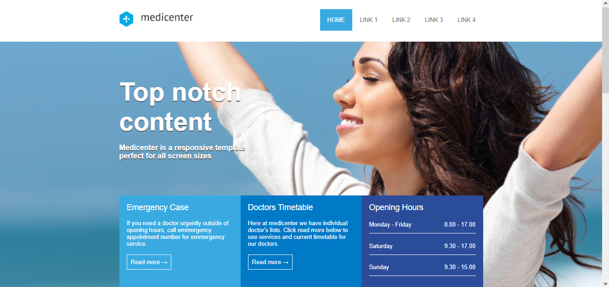
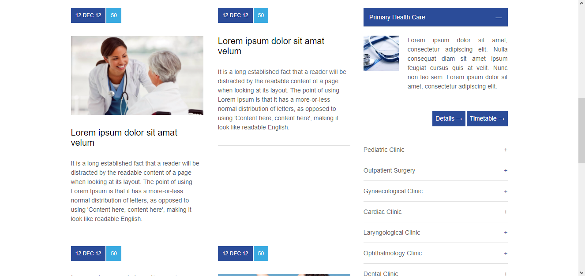
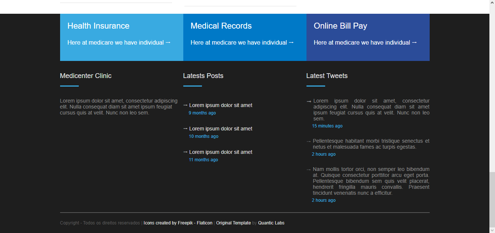

# B7Web - Criação de um website utilizando flexbox

Esse projeto faz parte do curso de HTML/CSS da [B7Web](https://b7web.com.br/fullstack/).

## Índice 

- [Resumo](#resumo)
  - [O projeto](#o-projeto)
  - [Screenshot](#screenshot)
  - [Links](#links)
- [Meu processo](#meu-processo)
  - [Desenvolvido com](#desenvolvido-com)
  - [O que eu aprendi](#o-que-eu-aprendi)
- [Autor](#autor)

## Resumo

### O projeto

O desenvolvimento deste site tem como objetivo colocar em prática os conteúdos vistos até o momento no curso. Os alunos deveriam ser capazes de desenvolver o site atráves das aulas que foram vistas anteriormente bem com as que acompanham o desenvolvimento do projeto.

### Screenshot

### Links

- [Template original](https://themeforest.net/item/medicenter-responsive-medical-health-template/4000598?irgwc=1&clickid=TwF3HfwKJxyIUhRU1FVePxpDUkGQ-a0HZ2nkyo0&iradid=275988&irpid=296919&iradtype=ONLINE_TRACKING_LINK&irmptype=mediapartner&mp_value1=&utm_campaign=af_impact_radius_296919&utm_medium=affiliate&utm_source=impact_radius)
- [Live site desenvolvido](https://tamiresataide.github.io/b7web-flexbox-website/)

## Meu processo

### Desenvolvido com

- HTML Semântico
- CSS
- Flexbox
- Mobile first CSS

### O que eu aprendi

Esse projeto foi uma ótima forma de ter uma experiência pratica da aplicação dos conteúdos que foram ensinados até o momento, mas em especial a aplicação do flexbox.

## Autor

- Github - [Tamires Ataíde](https://github.com/tamiresataide)
- Linkedin - [Tamires Ataíde](https://www.linkedin.com/in/tamiresataide/)

